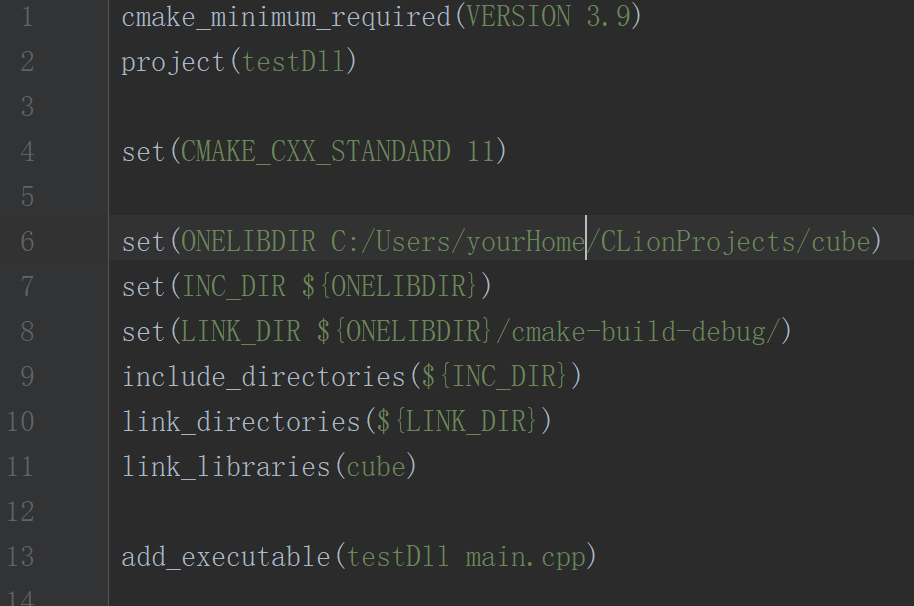
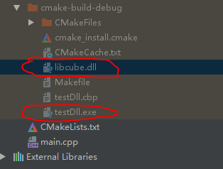

# 引用第三方动态库
除了CMakeLists.txt中要有如下设置
                
        set(CMAKE_CXX_STANDARD 11)

        include_directories(C:/mysql-5.6.21-win32/include)
        link_directories(C:/mysql-5.6.21-win32/lib/)
        link_libraries(mysql)
       

注意上面这一段配置要放在add_executable(...)的上面,

还要将dll文件放入目标二进制文件系统路径下

第一个红圈里的dll就是我们要引用的动态库,从别的地方拷贝过来的;第二个红圈是当前项目的构建产物.

如果没有将那个dll拷贝过来,运行当前项目会出现运行时错误:

        Process finished with exit code -1073741515 (0xC0000135)

# 引用第三方静态库
静态库的引用则不需要将.lib/.a 文件拷贝到当前项目目录中,只需要在CMakeLists.txt中加入和引用动态库需要在CMakeLists.txt中的配置一样的内容(将库路径和库名称换成静态库自己的)

# Operator Overload in C++
* 只能对已有的运算符进行重载,不能自定义新的运算符
* 除了成员访问符. 作用域运算符:: 长度运算符sizeof 条件运算符?:  其它运算符都可以重载
* 运算符重载后不能改变运算数个数.如"+"是实现两个操作数的运算符,重载后仍然为双目运算符.
* 重载不能改变运算符原有的优先级和结合性.
* 运算符重载不能全部是C++的内置类型,目的是防止用户修改用于基本类型数据的运算符性质
